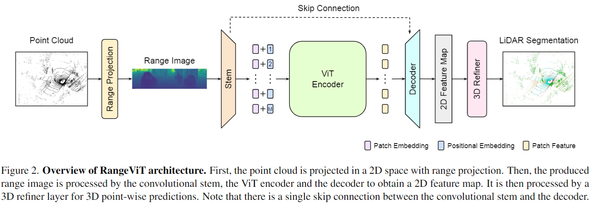

# Rotation supervision on 3D semantic segmentation


<div>
  
</div>

</div>

## **Citing**


```
@inproceedings{RangeViT,
  title={RangeViT: Towards Vision Transformers for 3D Semantic Segmentation in Autonomous Driving},
  author={Ando, Angelika and Gidaris, Spyros and Bursuc, Andrei and Puy, Gilles and Boulch, Alexandre and Marlet, Renaud},
  booktitle={CVPR},
  year={2023}
}
```
